# -用于《机械设计课程设计》中的减速箱设计的计算

## Requirement

- `Python 3+`

## FT来了一次适合华北理工大学的修改

## 1. Overview

几乎所有高校的机械类专业都有《机械设计课程设计》课程，课程内容几乎都是设计一个减速箱。可能是一级减速，二级减速等，可能是直齿齿轮减速，斜齿轮减速等。在进行课程设计时，齿轮、带传递、蜗轮蜗杆等传动部件的计算量庞大，而且极容易出错。有的同学可能是手按计算器，一步一步来，这样效率是极低的。为了提高计算效率以及优化设计，我在进行课设的时候，借助了Python语言计算。现在将我的程序上传到Github，帮助大家的学习。

程序已经上传Github，有需要的小伙伴可以去下载程序。也欢迎大家在知乎或者CSDN下评论。

Github 链接：https://github.com/HuimingPan/course-exercise-in-mechanical-design

CSDN 链接：https://blog.csdn.net/weixin_46191033/article/details/113738206

知乎链接：https://zhuanlan.zhihu.com/p/349813060

## 2. Structure

- caculation.py 是主程序；
- belt.py 带传动计算；
- coupling.py 滚动轴承计算；
- gear.py 齿轮传动计算；
- key.py 键连接计算；
- load_anlysis.py 轴上载荷计算；
- rolling_bearing.py 滚动轴承计算；
- shaft.py 轴直径的初步计算；

## 3. Deficiency

由于是在进行课设的时候写的程序，时间仓促，有很多不足待改进，也有很多想法没有能够实现。如果大家看到了这篇，希望能够一起来改进这个程序。

- 没有建立《课程设计》中涉及的国标数据库，在调用的时候，需要手动查表并输入；
- 没有建立AutoCAD的接口，使自动绘图；
- 不能进行优化设计；
- 没有引入机械动力学计算；

# 我来

进行带轮设计 大带轮输入轴开孔式

小带轮 实心式
D直径28  E长度60 F键槽长度8mm   轴的长度是60   轮毂做成62

大带轮 开孔式  输入轴的最细段

D直径28  E长度60 F键槽长度8mm

轴颈选个偶数 轴的直径20  那大带轮24吧内径

大带轮宽宽度64mm  3x15+2x10  宽度

带轮 比轴长点  轴选 62 长度

大带轮画一个草图

联轴器计算转距 279.0099395848182

取A_0=110,[τ_T]=28MPa
估算轴的直径 d=18.36618537926532mm
考虑键槽的影响，扩大轴的直径
轴上有 1 个键槽，直径增大5%
则 d=20mm
确定带轮结构
小带轮,采用实心结构
大带轮采用孔板式结构
d1=1。8d=1.8×26=46.8mm
查设计资料表7—8得  e=15，f=10,he =12，δ=6，φ=340，ba=11mm, =2.75

键的校核  键选  56

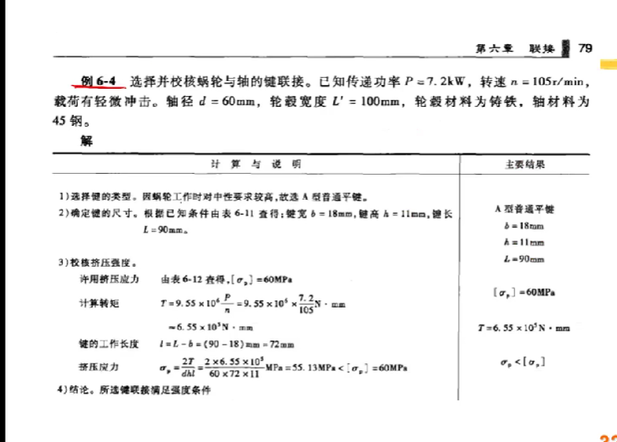

44.45106869720314
σ_bs= 41.34213978534518
第一根24mm的吧
对于第 2 根轴
取A_0=110,[τ_T]=34MPa
估算轴的直径 d=29.59609186162023mm
考虑键槽的影响，扩大轴的直径
轴上有 1 个键槽，直径增大5%
则 d=32mm

联轴器40mm的孔径

轴的设计

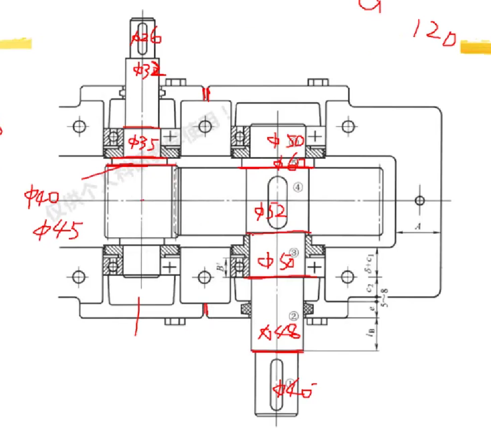

箱体的部分数据

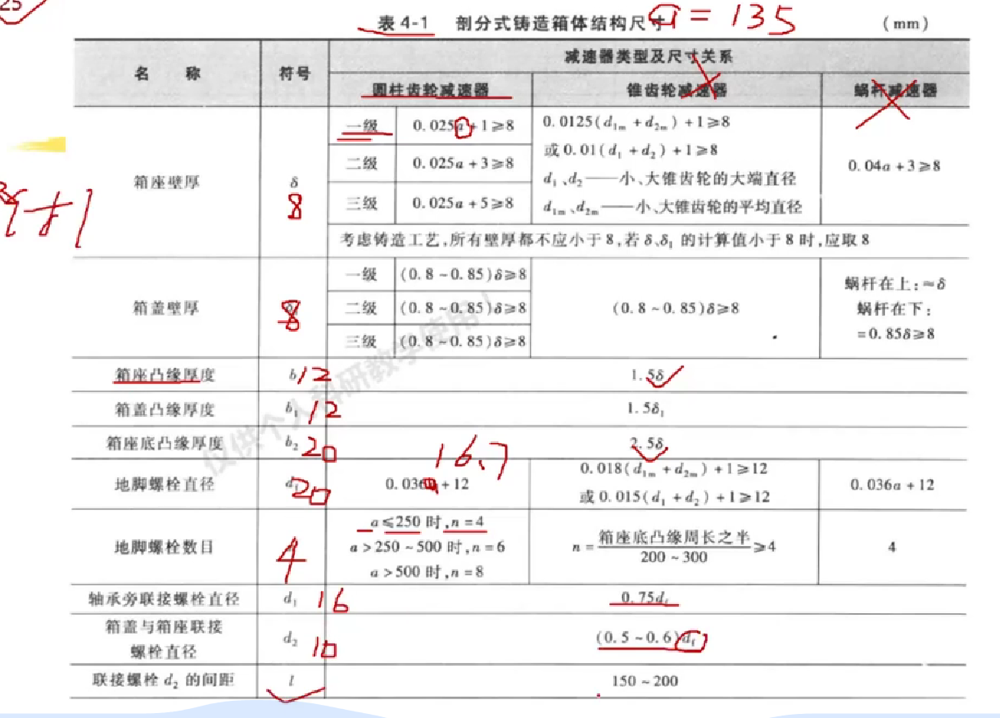

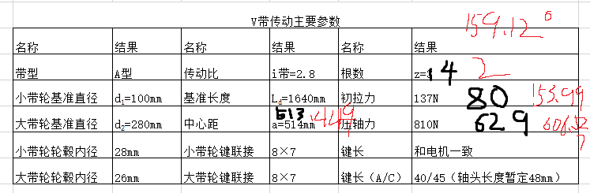

齿轮的齿根弯曲疲劳强度设计  齿面校核

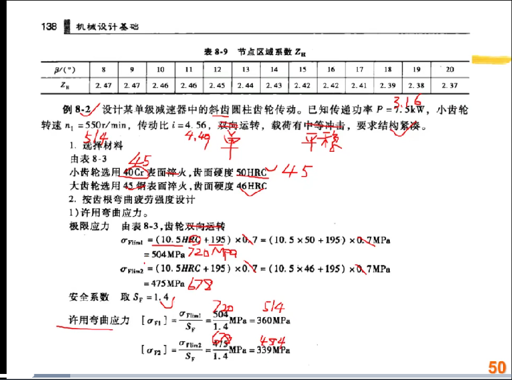

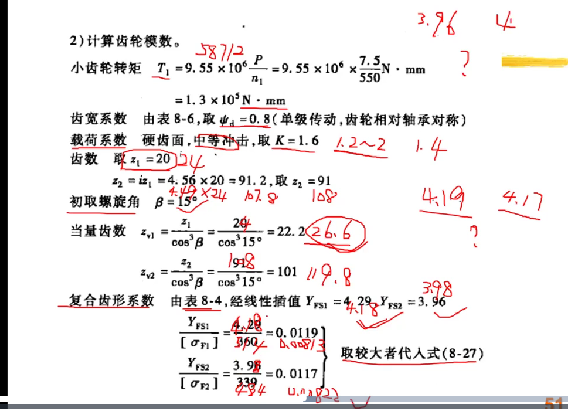

油润滑对一级齿轮 10mm 的齿高
轴承采用脂润滑当d（50）轴颈乘以n他的速度是114.6（）等于
密封装置采用封油盘

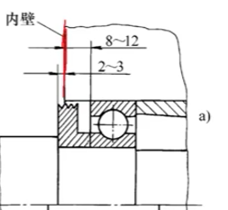

突出两到三毫米封油盘多款呢12的厚度 

主视图先画最底下这条线 起来5-8毫秒 箱座的壁厚8mm  圆整 起来30-50 到齿顶圆

先画轴心线 箱内 箱外 粗线 细线 p214-215

主视图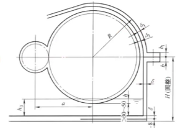

中心据135

分度圆一定要相切 对称线  30-50不管 要h圆整 齿顶圆直径有了    H 8+8+分度圆

透视孔要小手大小塞进去

大带轮宽宽度64mm  1x15+2x10  宽度 35了

带轮 比轴长点  轴选 62 长度

长度带轮50 最细轴48

为了操作空间  9.6嵌入式的轴承端盖B是56 6207

69

4 70 轴环 6

输出轴的强度校核 联轴器112 选好了？

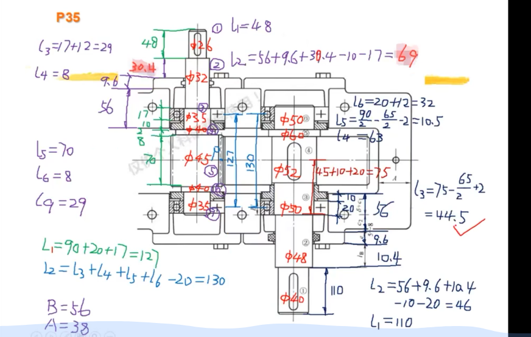

## 轴承支点位置

集中力键到底部的长度56     两个轴承中心的距离130 危险截面D

	(1)计算单根V带的额定功率 Pr
	   单根V带的基本额定功率 P0=1.32kW
	   单根V带的额定功率增量 ΔP0=0.17kW
	   修正系数 K_α=0.95,K_L=0.99
	   单根V带的额定功率为 1.401345 kW
	(2)计算V带的根数率 z
	   带的根数率 z=1.9437178596082263,取2根
7.确定带的初拉力 F0
	A型带的单位长度质量q=0.1kg/m
	单根V带的初拉力 F0=153.991801974537 N
8.确定带的压轴力 F_p
	带的压轴力 F_p=606.527249944012 N

B 35 带轮的长度

齿轮的计算 45钢         传递功率2.37715139255798  转速510.714285714285 传动比4.31305443033161 单向运转  平稳

齿面硬度 45 46 大小  

硬齿面  齿根弯曲疲劳强度设计 表面淬火

小齿轮（10.5HRC+195）=720Mpa                （10.5HRC+195）=678Mpa

安全系数SF=1.4              许用弯曲应力   514    484  转矩44.4510686972031  齿根园估计

z=24      z2=104

        m_nt_min = ((2 * K_Ft * T1  *(cos(radians(beta))) ** 2) / (phi_d * z1 ** 2) * num) ** (1 / 3)
        m_nt_min=2   1.2474056676737517
                                         
校核齿面接触强度 10HRC+670 =  #没算

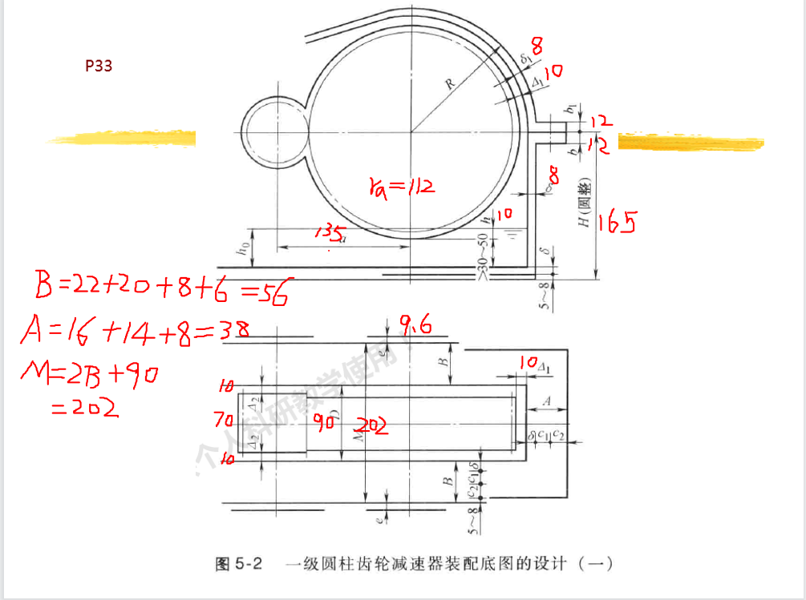

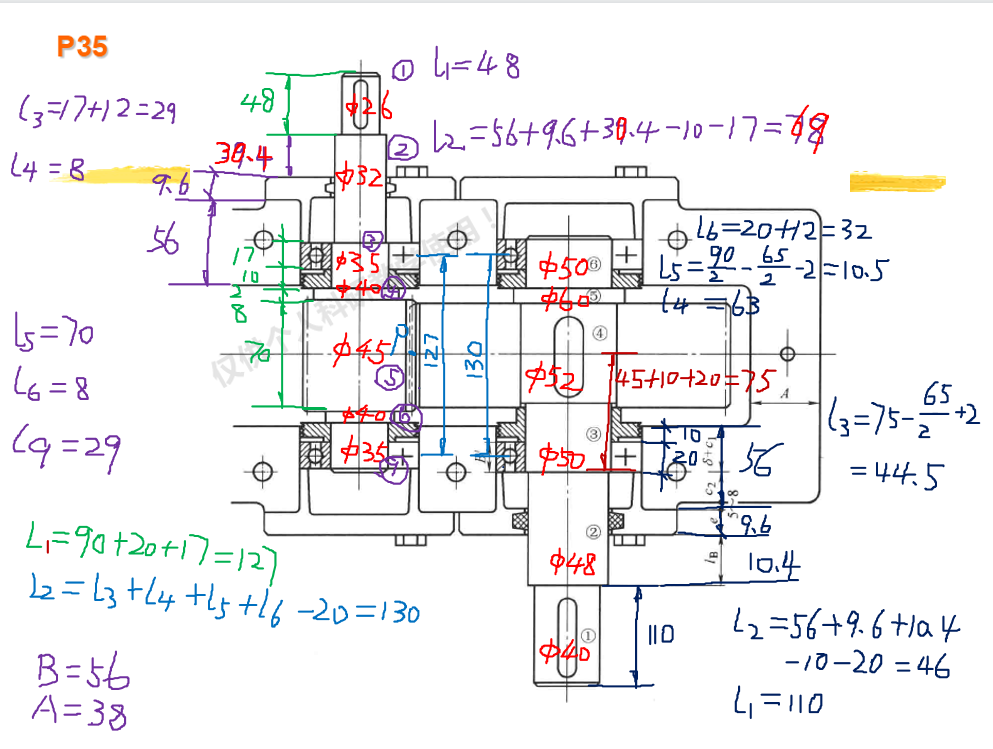

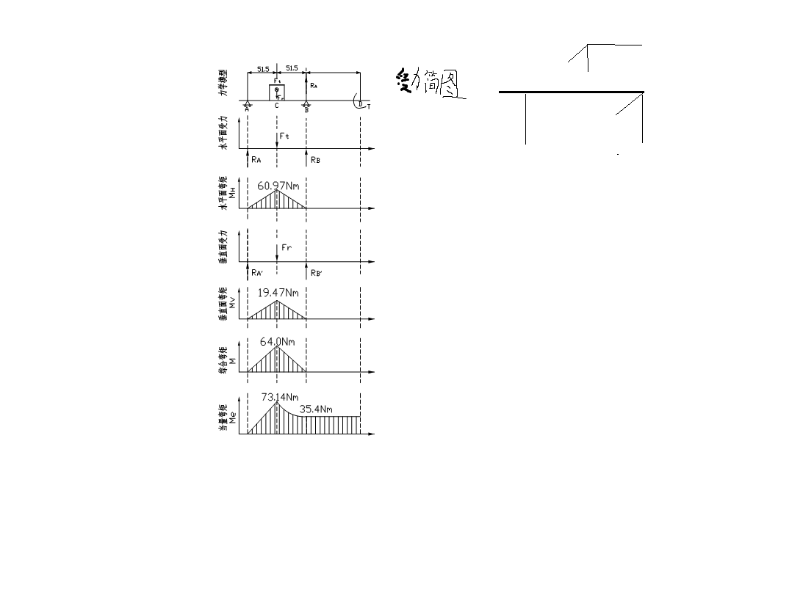

